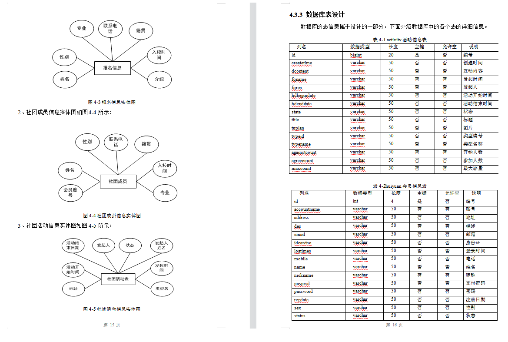
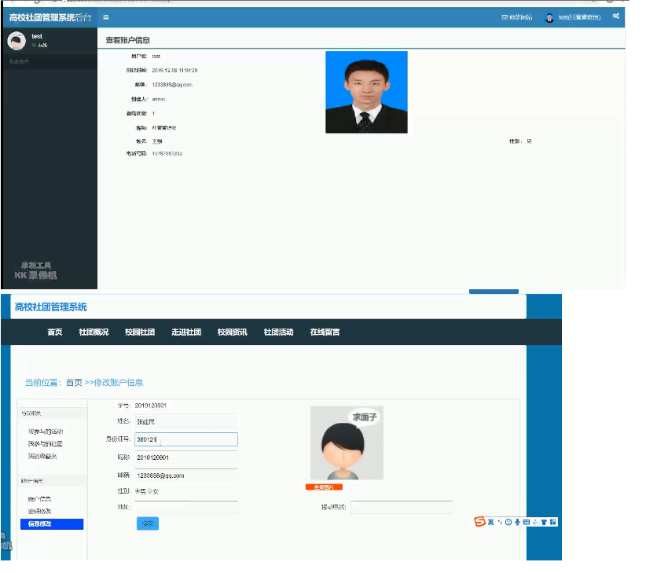

# ssm高校社团管理系统

#### 介绍
高校社团管理系统(ssm,mysql)

项目运行功能演示 https://www.bilibili.com/video/BV12F411J7bv

#### 软件架构
软件架构说明

高校社团管理系统(ssm，mysql)(毕业论文10607字以上,共34页,程序代码,MySQL数据库)

【项目包含内容】

【项目功能介绍】

高校社团管理系统的主要实现功能包括：学生：社团概况、校园社团、走进社团、校园资讯、社团活动、在线留言，管理员：网站设置、会员管理、后台用户管理、修改密码、我的账户信息、修改账户信息，社团管理员：社团事务：社团管理、社团人数统计、社团报名审批、社团活动管理、发布活动、活动分类管理，新闻资讯：新闻资讯管理、系统公告管理、新闻栏目管理等功能。通过这些功能模块的设计，基本上实现了整个高校社团信息管理的过程。

【文档包含内容】

高校社团管理系统(ssm，mysql)【论文+开题报告+任务书+答辩稿】(毕业论文10607字以上,共34页),  文档含有标准论文应有的各种学术性结构，术语以及软件工程对应的技术描述， 文档具有很强的参考和学习价值, 对于毕业生在设计论文时可以起到很重要的辅助作用, 在此文档上进行改造, 打磨，就可以成为自己的学术性论文, 这些文档需要通过融入自己的东西才能上交哦, 这里提供的是一种思路和借鉴, 论文中含有软件工程中涉及的模块分解图, ER图, 原理图等

【文档部分截图】

【数据库截图】

【项目运行截图】   

